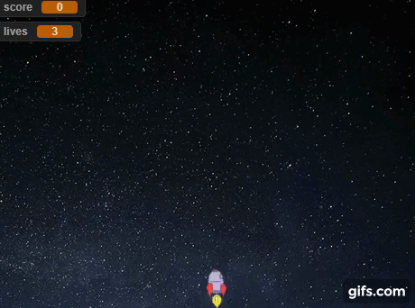
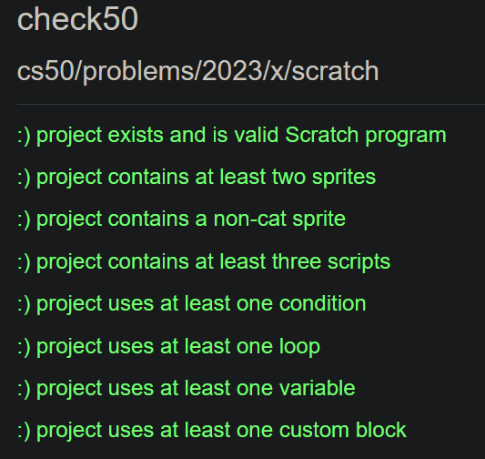

# Problem Set 0: Scratch

## Problem Description

Make a program in scratch with the following specifications:
- Your project must use at least two sprites, at least one of which must not be a cat.
- Your project must have at least three scripts total (i.e., not necessarily three per sprite).
- Your project must use at least one conditional, at least one loop, and at least one variable.
- Your project must use at least one custom block that you have made yourself (via Make a Block), which must take at least one input.
- Your project should be more complex than most of those demonstrated in lecture (many of which, though instructive, were quite short) but it can be less complex than Oscartime and Ivy’s Hardest Game.

## My solution

### Description

A laser-shooting spaceship that blows meteors to protect its home-planet; The spaceship moves horizontally while meteors come its way.

### Rules

Use the keys 'a' and 'd' to move the spaceship left and right.  Click the spacebar to shoot fireballs at meteors and score points. Score 10 points to win the game while avoiding letting 3 meteors slip or you'll lose.

### Demo

### Requirements

- [x] At least 2 sprites, at least 1 not being a cat
- [x] At least 3 scripts total
- [x] At least 1 conditional, 1 loop and 1 variable blocks
- [x] At least 1 custom block
- [x] Relatively complex

### Play it!
Play [pset0](https://scratch.mit.edu/projects/825451865/) on Scratch!

Alternatively you can download pset0.sb3 and load it onto scratch too!

## Score

