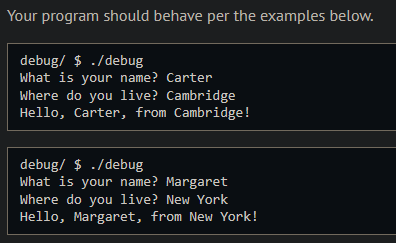
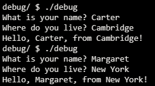
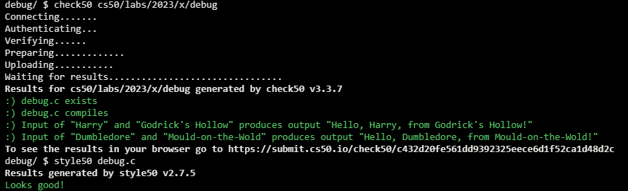

# Debug

## Problem Description

This lab starts with distribution code which has several syntactical errors. The idea is for you to try to compile (make) the program, learn to interpret the rather cryptic error messages output by the compiler, and debug the program.

## My solution

### Description

The file was missing the following:

- The stdio.h import
- Multiple semicolons
- Data type for the string variables initialization
- Wrong data type (int) for the string variables format placeholder at the greeting

### Output Expected

### Output obtained

## Score

