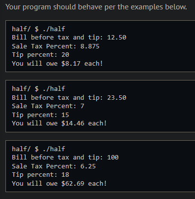
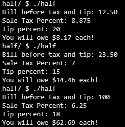
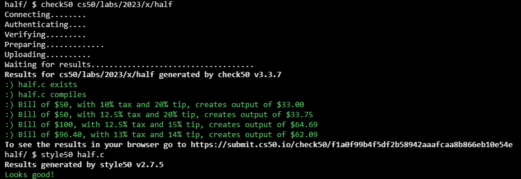

# Half

## Problem Description

Suppose you are eating out at a restaurant with a friend and want to split the bill evenly. You may want to anticipate the amount you’ll owe before the bill arrives with tax added. In this problem, you’ll complete a function to calculate the amount each of you owes based on the bill amount, the tax, and the tip.

Your function should use the input parameters, bill, tax, and tip, to calculate the final amount. However, since these values are percentages, you’ll have to do some work to convert these to more appropriate formats to use for your calculation.

The tax should be added to the bill amount before calculating the tip. Finally, you will return exactly half of the full amount, including the bill amount, the tax and the tip.

## My solution

### Description

Simple arithmetic for the most part. The 'tricks' are to treat the percent variables as such (divide them by 100) and to cast the tip as a float to be able to perform the float division.

### Output Expected

### Output obtained

## Score

