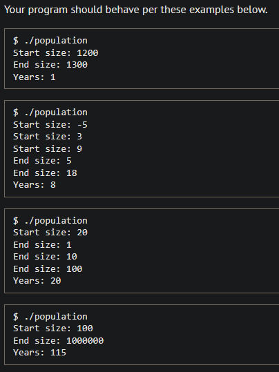
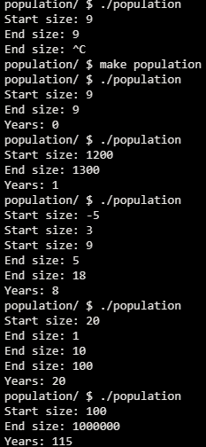
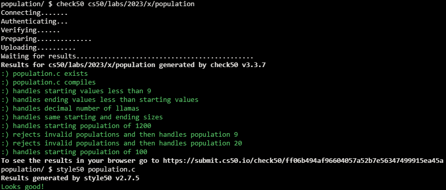

# Lab 1: Population Growth

## Problem Description

### Background

Say we have a population of n llamas. Each year, n / 3 new llamas are born, and n / 4 llamas pass away.

For example, if we were to start with n = 1200 llamas, then in the first year, 1200 / 3 = 400 new llamas would be born and 1200 / 4 = 300 llamas would pass away. At the end of that year, we would have 1200 + 400 - 300 = 1300 llamas.

To try another example, if we were to start with n = 1000 llamas, at the end of the year, we would have 1000 / 3 = 333.33 new llamas. We can’t have a decimal portion of a llama, though, so we’ll truncate the decimal to get 333 new llamas born. 1000 / 4 = 250 llamas will pass away, so we’ll end up with a total of 1000 + 333 - 250 = 1083 llamas at the end of the year.

### Implementation Details

Complete the implementation of population.c, such that it calculates the number of years required for the population to grow from the start size to the end size.

Your program should first prompt the user for a starting population size.
If the user enters a number less than 9 (the minimum allowed population size), the user should be re-prompted to enter a starting population size until they enter a number that is greater than or equal to 9. (If we start with fewer than 9 llamas, the population of llamas will quickly become stagnant!)
Your program should then prompt the user for an ending population size.
If the user enters a number less than the starting population size, the user should be re-prompted to enter an ending population size until they enter a number that is greater than or equal to the starting population size. (After all, we want the population of llamas to grow!)
Your program should then calculate the (integer) number of years required for the population to reach at least the size of the end value.
Finally, your program should print the number of years required for the llama population to reach that end size, as by printing to the terminal Years: n, where n is the number of years.

## My solution

### Description

After asking the user for the start and end population values, initialize a years variable to 0, while start is smaller than end, add to it 1/12 of its value and increase years by 1.

### Output Expected

### Output obtained

## Score

