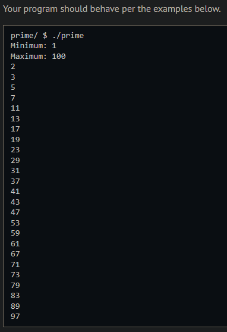
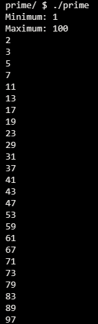
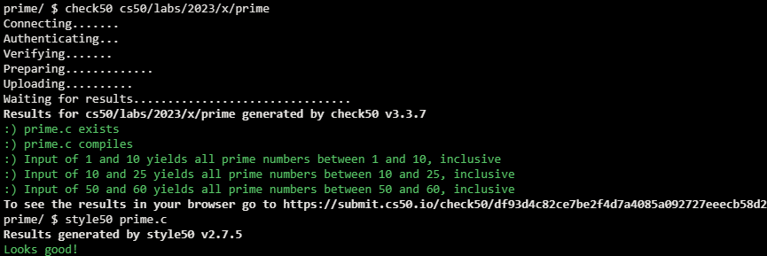

# Prime

## Problem Description

Prime numbers are defined as whole numbers greater than 1, whose only factors are 1 and itself. So 3 is prime because its only factors are 1 and 3, while 4 is composite and not prime, because it is the product of 2 × 2. In this lab you will write an algorithm to generate all prime numbers in a range specified by the user.

## My solution

### Description

For every number between min and max, loop through every number between 1 and itself, if the modulo of the number and any number not itself or 1 isn't 0, return false; otherwise return true.

### Output Expected

### Output obtained

## Score

