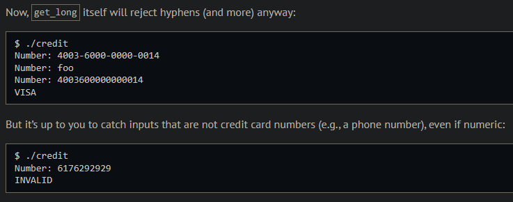
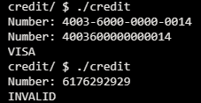
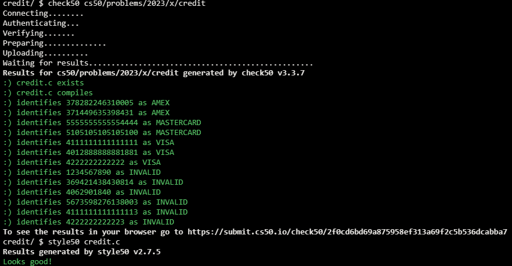

# Credit

## Problem Description

### Background

A credit (or debit) card, of course, is a plastic card with which you can pay for goods and services. Printed on that card is a number that’s also stored in a database somewhere, so that when your card is used to buy something, the creditor knows whom to bill. There are a lot of people with credit cards in this world, so those numbers are pretty long: American Express uses 15-digit numbers, MasterCard uses 16-digit numbers, and Visa uses 13- and 16-digit numbers. And those are decimal numbers (0 through 9), not binary, which means, for instance, that American Express could print as many as 10^15 = 1,000,000,000,000,000 unique cards! (That’s, um, a quadrillion.)

Actually, that’s a bit of an exaggeration, because credit card numbers actually have some structure to them. All American Express numbers start with 34 or 37; most MasterCard numbers start with 51, 52, 53, 54, or 55 (they also have some other potential starting numbers which we won’t concern ourselves with for this problem); and all Visa numbers start with 4. But credit card numbers also have a “checksum” built into them, a mathematical relationship between at least one number and others. That checksum enables computers (or humans who like math) to detect typos (e.g., transpositions), if not fraudulent numbers, without having to query a database, which can be slow. Of course, a dishonest mathematician could certainly craft a fake number that nonetheless respects the mathematical constraint, so a database lookup is still necessary for more rigorous checks.

#### Luhn's Algorithm:

1. Multiply every other digit by 2, starting with the number’s second-to-last digit, and then add those products’ digits together.
2. Add the sum to the sum of the digits that weren’t multiplied by 2.
3. If the total’s last digit is 0 (or, put more formally, if the total modulo 10 is congruent to 0), the number is valid!

### Implementation Details

In the file called credit.c in the credit directory, write a program that prompts the user for a credit card number and then reports (via printf) whether it is a valid American Express, MasterCard, or Visa card number, per the definitions of each’s format herein. So that we can automate some tests of your code, we ask that your program’s last line of output be AMEX\n or MASTERCARD\n or VISA\n or INVALID\n, nothing more, nothing less. For simplicity, you may assume that the user’s input will be entirely numeric (i.e., devoid of hyphens, as might be printed on an actual card) and that it won’t have leading zeroes. But do not assume that the user’s input will fit in an int! Best to use get_long from CS50’s library to get users’ input.

## My solution

### Description

Use the modulus operator to iterate the credit card number from its last digit to its first one; as the iteration takes place I use a counter variable 'i' to figure out both the digit's parity as well as the card's number length.

I add each digit to a sum variable as is, unless the counter is pair in which case I double it and add its corresponding digits to the sum as per Luhn's algorithm. If after that the checksum doesn't add up I return a -1, otherwise I return the length of the number.

Finally I simply use a switch statement and modulus operations to verify the card's type based on its initial digits.

### Output Expected

### Output obtained

## Score

