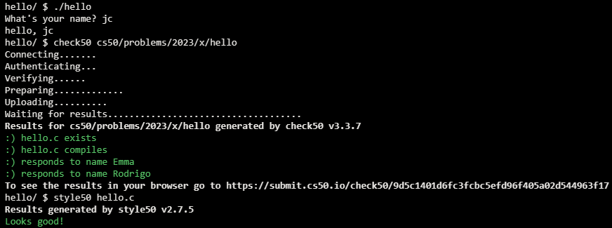

# Hello

## Problem Description

Implement a program which asks the user for their name and use it to greet them.

## My solution

### Description

Ask the user for their name and use it to greet them.

## Output and score

