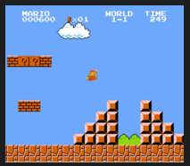
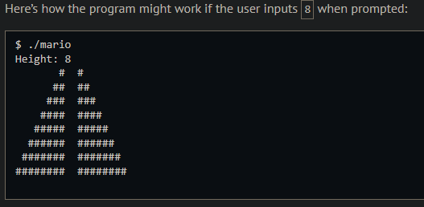
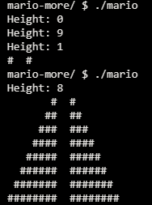
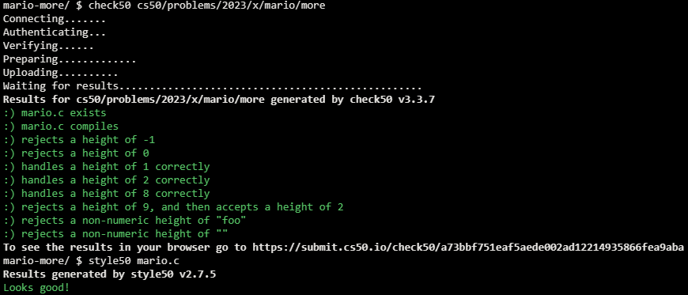

# Mario-More

## Problem Description

### Background

Toward the beginning of World 1-1 in Nintendo’s Super Mario Brothers, Mario must hop over adjacent pyramids of blocks, per the below.

Let’s recreate those pyramids in C, albeit in text, using hashes (#) for bricks. Each hash is a bit taller than it is wide, so the pyramids themselves will also be taller than they are wide.

### Implementation Details

The program we’ll write will be called mario. And let’s allow the user to decide just how tall the pyramids should be by first prompting them for a positive integer between, say, 1 and 8, inclusive.

## My solution

### Description

Ask the user for a valid height value, then print each level of the pyramid, starting from the top. For each level, fill its left side with spaces based on the difference in size between the maximum level (height) and current one.

### Output Expected

### Output obtained

## Score

