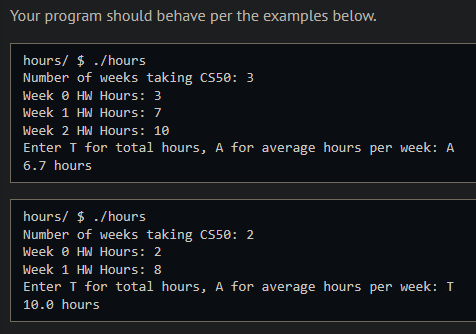
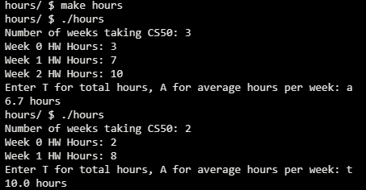
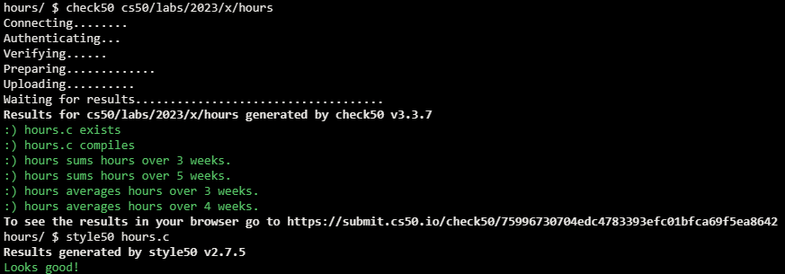

# Hours

## Problem Description

### Background

Suppose you’re taking CS50 (if you’re reading this you probably are!) and spending time every week on each problem set. You may be wondering how many hours you’ve spent learning computer science, on average or in total! In this program, you’ll complete a function that calculates, based on a user’s input, a total number of hours or an average number of hours across a given number of days.

### Implementation Details

The main function prompts the user for the number of weeks a user has been taking CS50, then creates an array with as many elements. Notice that, after retrieving some data, the program prompts the user to type in either “T” or “A”—”T” should (but doesn’t yet!) print the total number of hours the user entered, while “A” should (but doesn’t yet!) print the average hours the user entered. Notice that the do while loop uses toupper to capitalize the letter that’s input before it is saved in the variable output. Then, the printf function calls calc_hours. Note the syntax involved when passing an array to a function.

To complete calc_hours, first total up the hours saved in the array into a new variable. Then, depending on the value of output, return either this sum, or the average number of hours.

## My solution

### Description

Iterate over the elements of the 'hours' array and add them up, if 'output' is 'T' return the total value, otherwise return their average.

### Output Expected

### Output obtained

## Score

