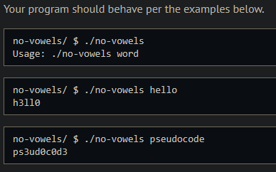
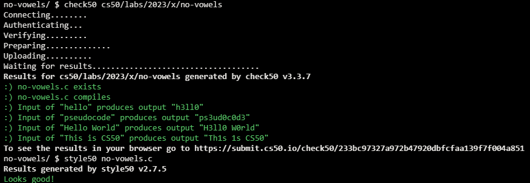

# No Vowels

## Problem Description

### Background

If you’ve been on the internet, you might have seen “leetspeak” (or “l33tsp36k” for our purposes!), which involves the substitution of symbols for alphabetical characters, where those symbols somewhat resemble their alphabetical counterparts. In this lab, you’ll write a program to replace certain vowels with digits!

Up until now, you’ve frequently written programs for which you’ve been provided distribution code. You’ll notice when downloading the “distro” for this problem, you start with nothing more than a couple of commonly used libraries and an empty main function. In this problem, you will convert a word, which you will input at the command line, to a corresponding word with numbers replacing vowels.

### Implementation Details

- Implement your program in a file called no-vowels.c in a directory called no-vowels.
- Your program must accept a single command-line argument, which will be the word that you want to convert.
- If your program is executed without any command-line arguments or with more than one command-line argument, your program should print an error message of your choice (with printf) and return from main a value of 1 (which tends to signify an error) immediately.
- Your program must contain a function called replace which takes a string input and returns a string output.
- This function will change the following vowels to numbers: a becomes 6, e becomes 3, i becomes 1, o becomes 0 and u does not change.
- The input parameter for the replace function will be argv[1] and the return value is the converted word.
- The main function will then print the converted word, followed by \n.
You may want to try using the switch statement in your replace function.

## My solution

### Description

Iterate over argv[1]'s characters, if the char being analyzed is any of the vowels to change, do so, otherwise ingore.

### Output Expected

### Output obtained

## Score

## Usage

- Compile it
- Type './no-vowels word' on your command line 