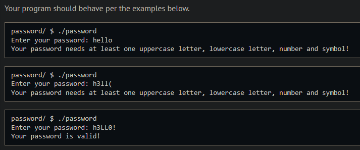
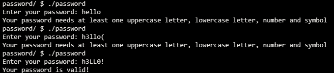
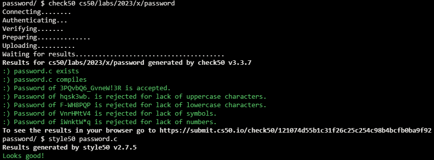

# Password

## Problem Description

### Background

As we all know by now, it’s important to use passwords that are not easy to guess! Many web apps now require passwords that require not only alphabetical characters, but also number and symbols.

In this lab, the user is prompted for a password, which will then be validated using a function check that you will complete. If the password contains at least one upper case letter, one lower case letter, a number, and a symbol (meaning a printable character that’s not a letter or number, such as ‘!’, ‘$’ and ‘#’), the function should return true. If not it should return false.

### Implementation Details

Your function will iterate through the password that’s supplied to it as an argument. Since you have to find at least one lower case letter, one upper case letter, one number and one symbol, you may want to create a boolean variable for each and set each to false before you iterate through the string. If you then find a number, for instance you can set that boolean to true. If all booleans are true at the end of the function, it means all criteria are met, and you would return true.

## My solution

### Description

Iterate over every character in the password, checking if they meet any of the requirements and if so updates the respective flag, if all are true by the end, validate the password.

### Output Expected

### Output obtained

## Score

## Usage

1. Compile it
2. Type './password' on your command line and follow the prompt