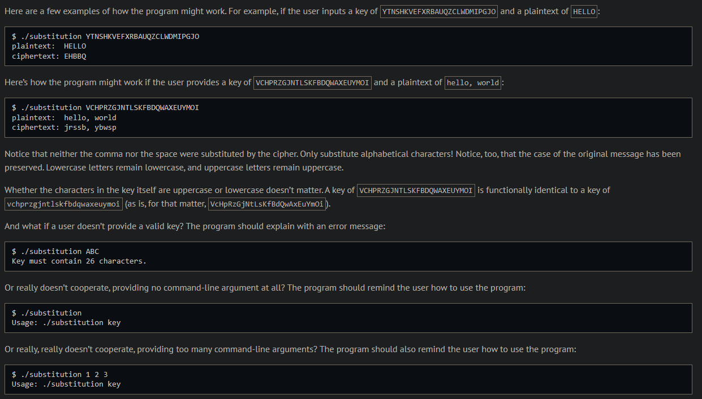
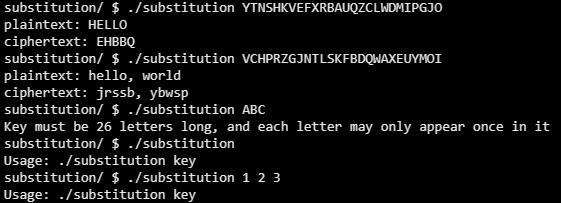
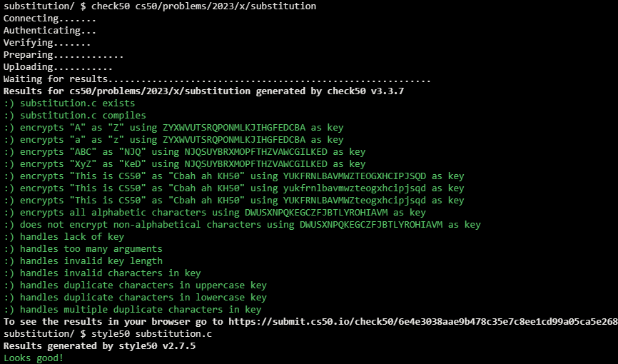

# Substitution

## Problem Description

### Background

In a substitution cipher, we “encrypt” (i.e., conceal in a reversible way) a message by replacing every letter with another letter. To do so, we use a key: in this case, a mapping of each of the letters of the alphabet to the letter it should correspond to when we encrypt it. To “decrypt” the message, the receiver of the message would need to know the key, so that they can reverse the process: translating the encrypt text (generally called ciphertext) back into the original message (generally called plaintext).

A key, for example, might be the string NQXPOMAFTRHLZGECYJIUWSKDVB. This 26-character key means that A (the first letter of the alphabet) should be converted into N (the first character of the key), B (the second letter of the alphabet) should be converted into Q (the second character of the key), and so forth.

A message like HELLO, then, would be encrypted as FOLLE, replacing each of the letters according to the mapping determined by the key.

Let’s write a program called substitution that enables you to encrypt messages using a substitution cipher. At the time the user executes the program, they should decide, by providing a command-line argument, on what the key should be in the secret message they’ll provide at runtime.

### Implementation Details

Design and implement a program, substitution, that encrypts messages using a substitution cipher.

Implement your program in a file called substitution.c in a directory called substitution.
- Your program must accept a single command-line argument, the key to use for the substitution. The key itself should be case-insensitive, so whether any character in the key is uppercase or lowercase should not affect the behavior of your program.
- If your program is executed without any command-line arguments or with more than one command-line argument, your program should print an error message of your choice (with printf) and return from main a value of 1 (which tends to signify an error) immediately.
- If the key is invalid (as by not containing 26 characters, containing any character that is not an alphabetic character, or not containing each letter exactly once), your program should print an error message of your choice (with printf) and return from main a value of 1 immediately.
- Your program must output plaintext: (without a newline) and then prompt the user for a string of plaintext (using get_string).
- Your program must output ciphertext: (without a newline) followed by the plaintext’s corresponding ciphertext, with each alphabetical character in the plaintext substituted for the corresponding character in the ciphertext; non-alphabetical characters should be outputted unchanged.
- Your program must preserve case: capitalized letters must remain capitalized letters; lowercase letters must remain lowercase letters.
- After outputting ciphertext, you should print a newline. Your program should then exit by returning 0 from main.

You might find one or more functions declared in ctype.h to be helpful, per manual.cs50.io.

## My solution

### Description

Iterate over the key provided to validate it, checking lengt and letter occurance, then iterate over the plaintext switching each letter for its ciphered counterpart while respecting its case.

### Output Expected

### Output obtained

## Score

## Usage

1. Compile substitution.c
2. Run './substitution key' on your command line and follow the prompt