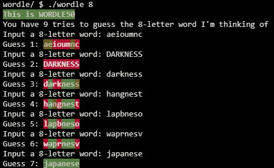

# Wordle

## Problem Description

### Background

Odds are, if you’re a Facebook user, at least one of your friends posted something looking like this, particularly back in early 2022 when it was all the rage:

If so, your friend has played Wordle, and are sharing their results for that day! Each day, a new “secret word” is chosen (the same for everyone) and the object is to guess what the secret word is within six tries. Fortunately, given that there are more than six five-letter words in the English language, you may get some clues along the way, and the image above actually shows your friend’s progression through their guesses, using those clues to try to home in on the correct word. Using a scheme similar to the game Mastermind, if after you guess that letter turns green, it means not only is that letter in the secret word that day, but it is also in the correct position. If it turns yellow, it means that the letter guessed appears somewhere in the word, but not in that spot. Letters that turn gray aren’t in the word at all and can be omitted from future guesses.

Let’s finish writing a program called wordle that enables us to recreate this game and play it in our terminal instead. We’ll make a few slight changes to the game (for example, the way it handles a letter appearing twice in a word isn’t the same as how the real game handles it, but for simplicity’s sake, we’ll err on the side of ease of understanding rather than a perfectly faithful interpretation), and we’ll use red text instead of gray to indicate letters that aren’t in the word at all. At the time the user executes the program, they should decide, by providing a command-line argument, what the length of the word they want to guess is, between 5 and 8 letters.

### Implementation Details

Design and implement a program, wordle, that completes the implementation of our Wordle50 clone of the game. You’ll notice that some large pieces of this program have already been written for you–you are not allowed to modify any of those parts of the program. Instead, your work should be constrained to the seven TODOs we’ve left behind for you to fill in. Each one of those parts solves a specific problem, and we recommend you tackle them in order from 1 to 7.

## My solution

### Description

Mostly followed instructions really, it was a heavily guided exercise.

### Execution Example

## Score

## Usage

1. Compile wordle.c
2. Run './wordle word-size' on your command line and follow the prompt