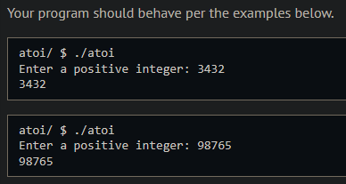
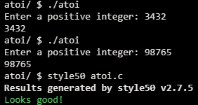

# Atoi

## Problem Description

### Background

Image that you travel back in time to the 1970’s, when the C programming language was first created. You are hired as a programmer to come up with a way to convert strings to ints. (You may have used a function just like this in Week 2, called atoi). You want to be thorough in your development process and plan to try several approaches before deciding on the most efficient.

In this problem, you will start with a simple implementation of atoi that handles positive ints using loops. You want to rework this into an implementation that uses recursion. Recusive functions can be memory intensive and are not always the best solution, but there are some problems in which using recursion can provide a simpler and more elegant solution.


### Implementation Details

In the recursive version of convert, start with the last char and convert it into an integer value. Then shorten the string, removing the last char, and then recursively call convert using the shortened string as input, where the next char will be processed.

## My solution

### Description

<span style="color:red">Disclaimer: Unfortunately I wasn't able to solve this problem as described, and resorted to a minor modification in the design provided. The design stated above had us build a recursive function which header had been provided to include 1 parameter (string input), but nothing else; I couldn't solve the problem just with that and added the int paramter 'pos' to work with the decimal place of the number being worked on.</span>.

```c
// Takes a string and returns it as an integer
// 'pos' refers to its base 10 position
int convert(string input, int pos)
{
    int n = strlen(input);

    // Base case, the string is empty
    if (n == 0)
    {
        return 0;
    }
    else
    {
        // Modifies input by removing its last character
        char last = input[n - 1];
        input[n - 1] = '\0';

        // Turns the last char (stored in 'last') into an int
        // Changing its ascii value into that of its int counterpart
        // Then casting that to int
        int val = ((int) last - 48) * pos;
        return (val + convert(input, pos * 10));
    }
}
```

Without the 'pos' variable and sticking to the recursive nature intended, I could only add each digit as such, ignoring its decimal place within the larger number.

### Output Expected



### Output obtained



## Score

Not submittable.

## Usage

1. Compile atoi.c
2. Run './atoi' on your command line and follow the prompt