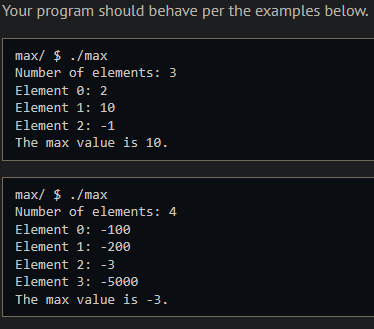
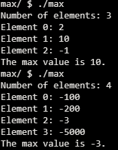
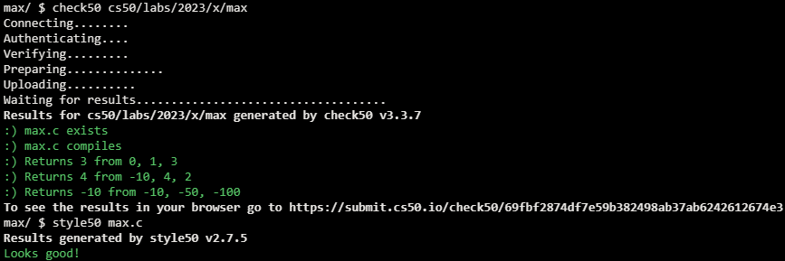

# Max

## Problem Description

### Background

There are many situations where you’ll find it helpful to have a function that finds the maximum (and minimum) value in an array. Since there is no built-in max function in C, you’ll create one in this practice problem. You can then use it in upcoming problem sets where it may be helpful!

### Implementation Details

The main function initializes the array, asks the user to enter values, and then passes the array and the number of items to the max function. Complete the max function by iterating through every element in the array, and return the maximum value.

## My solution

### Description

Initialize a 'max' variable to the first element of the array, iterate over the array while comparing each value to max and update max if any of the elements is greater than it.

```c
// Return the max value
int max(int array[], int n)
{
    int max = array[0]; // Value to return, initially the first one in the array

    // Go through every element in the array, compare it to 'max' and place the larger one on 'max'
    for (int i = 1; i < n; i++)
    {
        if (array[i] > max)
        {
            max = array[i];
        }
    }
    return max;
}
```

### Output Expected



### Output obtained



## Score



## Usage

1. Compile max.c
2. Run './max' on your command line and follow the prompt