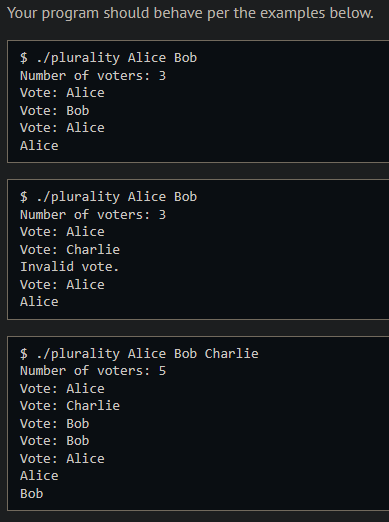
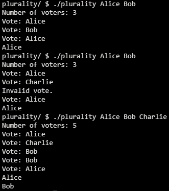

# Plurality

## Problem Description

### Background

Elections come in all shapes and sizes. In the UK, the Prime Minister is officially appointed by the monarch, who generally chooses the leader of the political party that wins the most seats in the House of Commons. The United States uses a multi-step Electoral College process where citizens vote on how each state should allocate Electors who then elect the President.

Perhaps the simplest way to hold an election, though, is via a method commonly known as the “plurality vote” (also known as “first-past-the-post” or “winner take all”). In the plurality vote, every voter gets to vote for one candidate. At the end of the election, whichever candidate has the greatest number of votes is declared the winner of the election.

### Implementation Details

Let’s take a look at plurality.c and read through the distribution code that’s been provided to you.

The line #define MAX 9 is some syntax used here to mean that MAX is a constant (equal to 9) that can be used throughout the program. Here, it represents the maximum number of candidates an election can have.

The file then defines a struct called a candidate. Each candidate has two fields: a string called name representing the candidate’s name, and an int called votes representing the number of votes the candidate has. Next, the file defines a global array of candidates, where each element is itself a candidate.

Now, take a look at the main function itself. See if you can find where the program sets a global variable candidate_count representing the number of candidates in the election, copies command-line arguments into the array candidates, and asks the user to type in the number of voters. Then, the program lets every voter type in a vote (see how?), calling the vote function on each candidate voted for. Finally, main makes a call to the print_winner function to print out the winner (or winners) of the election.

If you look further down in the file, though, you’ll notice that the vote and print_winner functions have been left blank. This part is up to you to complete!

## My solution

### Description

To cast a vote simply iterate over all the elements in the 'candidates' array and compare the argument given to the name of each candidate, if they're the same, increase vote.

```c
// Update vote totals given a new vote
bool vote(string name)
{
    for (int i = 0; i < candidate_count; i ++)
    {
        if (strcmp(candidates[i].name, name) == 0)
        {
            candidates[i].votes++;
            return true;
        }
    }
    return false;
}
```

To print the winner(s), iterate over the array and find the maximum amount of votes, then iterate again and print the name of any candidate with it.

```c
// Print the winner (or winners) of the election
void print_winner(void)
{
    int max = 0;
    for (int i = 0; i < candidate_count; i++)
    {
        max = candidates[i].votes > max ? candidates[i].votes : max;
    }
    for (int i = 0; i < candidate_count; i++)
    {
        if (candidates[i].votes == max)
        {
            printf("%s\n", candidates[i].name);
        }
    }
    return;
}
```

### Output Expected



### Output obtained



## Score


## Usage

1. Compile plurality.c
2. Run './plurality candidate0 candidate1...' on your command line and follow the prompt