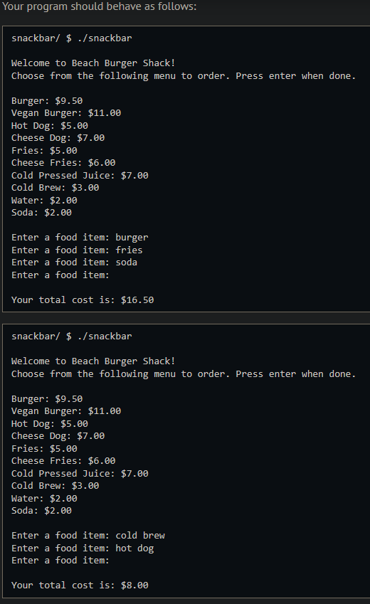
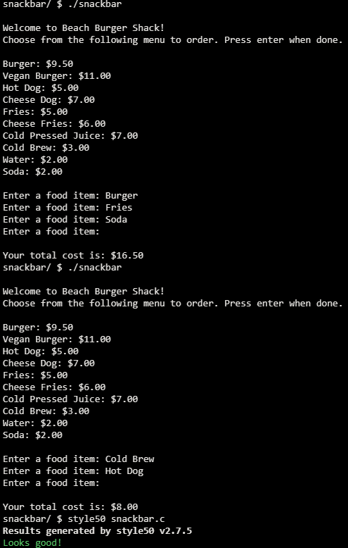

# Snackbar

## Problem Description

### Background

Imagine you’re at the beach and want to order a number of items from the snack bar. You have a limited amount of cash on you, and you want to get a total cost for your items before ordering. In snackbar.c you will complete two functions. First is add_items which will add at least the first 4 items on the Beach Burger Shack menu. Then you will complete get_cost which will implement a linear search algorithm to search for each item you choose, and return the corresponding price.

### Implementation Details

The main function is already complete. After calling add_items to initialize the menu array, it will print out the menu items and their prices, prompting you to keep selecting items until you press enter without typing anything in. You are to complete two functions, add_items, which adds at least the first four menu items, and get_cost to return the cost of each item. When you are creating a linear search algorithm in get_cost, do make sure that it is case insentive.

## My solution

### Description

Iterate over the elements of the 'menu' global array and compare each one with 'item', if there's a match return its corresponding price value.

```c
// Search through the menu array to find an item's cost
float get_cost(string item)
{
    for (int i = 0; i < NUM_ITEMS; i++)
    {
        if (strcmp(menu[i].item, item) == 0)
        {
            return menu[i].price;
            break;
        }
    }
    return 0.0;
}

```

### Output Expected



### Output obtained



## Score

Not submittable.

## Usage

1. Compile snackbar.c
2. Run './snackbar' on your command line and follow the prompt