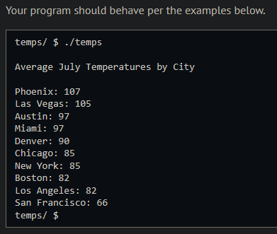
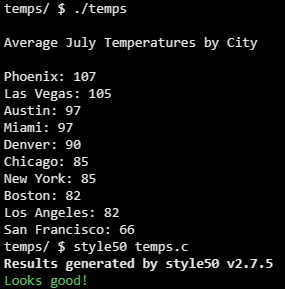

# Temps

## Problem Description

### Background

We seem to be breaking records every year for the hottest weather ever recorded. Climate scientists keep track of what are called “new normals” over multiple years so that we can better predict and prepare for conditions in the near future. The official normals are calculated for a uniform 30 year period, and consist of annual/seasonal, monthly, daily, and hourly averages and statistics of temperature, precipitation, and other climatological variables from almost 15,000 U.S. weather stations.

July is the hottest month of the year for most large US cities. Daytime temperatures above 80 degrees Fahrenheit regularly occur nearly everywhere. The exceptions are some cities along the Pacific coast.

In this problem, you will sort the average high temperature values for 10 cities, in decending order.


### Implementation Details

The main function initializes the temps array, calls the sort_cities function and prints out the array in sorted order. You will use an O(n2) sorting algorithm of your choice (possibly bubble sort, selection sort, or insertion sort) to sort the array by temperature, in descending order.

## My solution

### Description

Decided to implement bubble sort, no particular reason for it. Iterate over the array 'temps' $n^2$ times, comparing each city with the one next to it, pushing the one with the lower temperature to the end of the array.

```c
// Sort cities by temperature in descending order
// Bubble sort
void sort_cities(void)
{
    avg_temp tmp; // For the swap
    bool swap = true;

    // Push the smallest temperature to the right
    for (int i = NUM_CITIES - 1; i > 0 || swap == false; i--)
    {
        swap = false;
        for (int j = 0; j < i; j++)
        {
            if (temps[j].temp < temps[j + 1].temp)
            {
                tmp = temps[j + 1];
                temps[j + 1] = temps[j];
                temps[j] = tmp;
                swap = true;
            }
        }
    }
}
```

### Output Expected



### Output obtained



## Score

Not submittable.

## Usage

1. Compile temps.c
2. Run './temps' on your command line