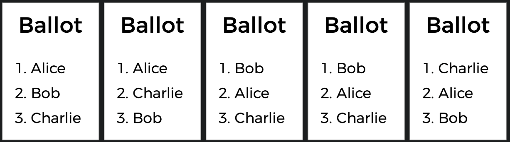
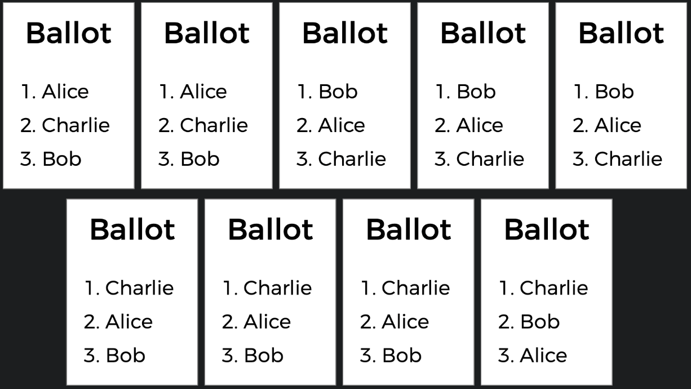
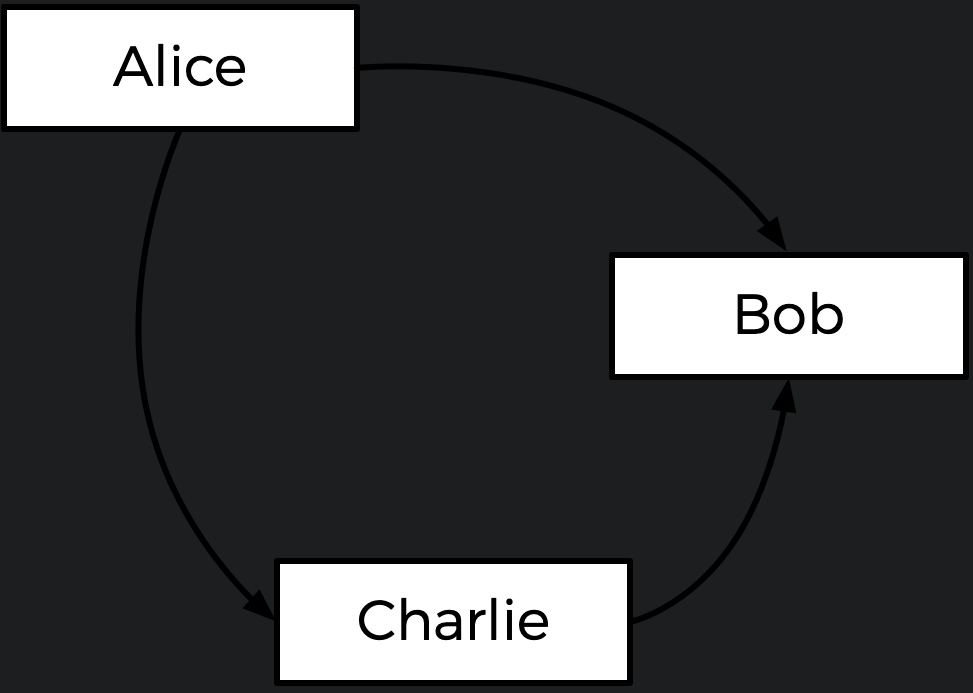
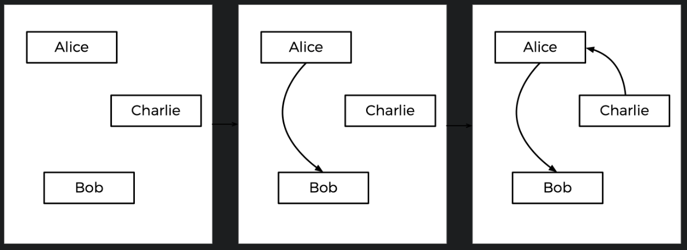
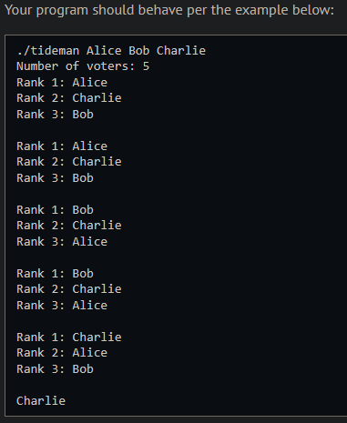
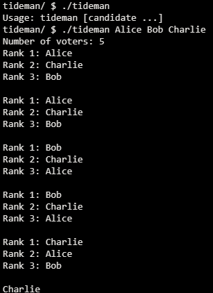
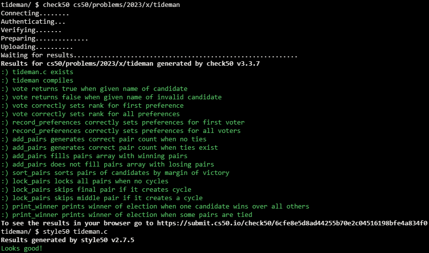

# Tideman

## Problem Description

### Background

There’s another kind of voting system known as a ranked-choice voting system. In a ranked-choice system, voters can vote for more than one candidate. Instead of just voting for their top choice, they can rank the candidates in order of preference. The resulting ballots might therefore look like the below.



Here, each voter, in addition to specifying their first preference candidate, has also indicated their second and third choices. And now, what was previously a tied election could now have a winner. The race was originally tied between Alice and Bob. But the voter who chose Charlie preferred Alice over Bob, so Alice could here be declared the winner.

Ranked choice voting can also solve yet another potential drawback of plurality voting. Take a look at the following ballots.



Alice is, in this election, the so-called “Condorcet winner” of the election: the person who would have won any head-to-head matchup against another candidate. If the election had been just Alice and Bob, or just Alice and Charlie, Alice would have won.

The Tideman voting method (also known as “ranked pairs”) is a ranked-choice voting method that’s guaranteed to produce the Condorcet winner of the election if one exists.

Generally speaking, the Tideman method works by constructing a “graph” of candidates, where an arrow (i.e. edge) from candidate A to candidate B indicates that candidate A wins against candidate B in a head-to-head matchup. The graph for the above election, then, would look like the below.



The arrow from Alice to Bob means that more voters prefer Alice to Bob (5 prefer Alice, 4 prefer Bob). Likewise, the other arrows mean that more voters prefer Alice to Charlie, and more voters prefer Charlie to Bob.

Looking at this graph, the Tideman method says the winner of the election should be the “source” of the graph (i.e. the candidate that has no arrow pointing at them). In this case, the source is Alice — Alice is the only one who has no arrow pointing at her, which means nobody is preferred head-to-head over Alice. Alice is thus declared the winner of the election.

It’s possible, however, that when the arrows are drawn, there is no Condorcet winner. Consider the below ballots.

Between Alice and Bob, Alice is preferred over Bob by a 7-2 margin. Between Bob and Charlie, Bob is preferred over Charlie by a 5-4 margin. But between Charlie and Alice, Charlie is preferred over Alice by a 6-3 margin. If we draw out the graph, there is no source! We have a cycle of candidates, where Alice beats Bob who beats Charlie who beats Alice (much like a game of rock-paper-scissors). In this case, it looks like there’s no way to pick a winner.

To handle this, the Tideman algorithm must be careful to avoid creating cycles in the candidate graph. How does it do this? The algorithm locks in the strongest edges first, since those are arguably the most significant. In particular, the Tideman algorithm specifies that matchup edges should be “locked in” to the graph one at a time, based on the “strength” of the victory (the more people who prefer a candidate over their opponent, the stronger the victory). So long as the edge can be locked into the graph without creating a cycle, the edge is added; otherwise, the edge is ignored.

How would this work in the case of the votes above? Well, the biggest margin of victory for a pair is Alice beating Bob, since 7 voters prefer Alice over Bob (no other head-to-head matchup has a winner preferred by more than 7 voters). So the Alice-Bob arrow is locked into the graph first. The next biggest margin of victory is Charlie’s 6-3 victory over Alice, so that arrow is locked in next.

Next up is Bob’s 5-4 victory over Charlie. But notice: if we were to add an arrow from Bob to Charlie now, we would create a cycle! Since the graph can’t allow cycles, we should skip this edge, and not add it to the graph at all. If there were more arrows to consider, we would look to those next, but that was the last arrow, so the graph is complete.

This step-by-step process is shown below, with the final graph at right.



### Implementation Details

Complete the implementation of tideman.c in such a way that it simulates a Tideman election.

- Complete the vote function.
  - The function takes arguments rank, name, and ranks. If name is a match for the name of a valid candidate, then you should update the ranks array to indicate that the voter has the candidate as their rank preference (where 0 is the first preference, 1 is the second preference, etc.)
  - Recall that ranks[i] here represents the user’s ith preference.
  - The function should return true if the rank was successfully recorded, and false otherwise (if, for instance, name is not the name of one of the candidates).
  - You may assume that no two candidates will have the same name.
- Complete the record_preferences function.
  - The function is called once for each voter, and takes as argument the ranks array, (recall that ranks[i] is the voter’s ith preference, where ranks[0] is the first preference).
  - The function should update the global preferences array to add the current voter’s preferences. Recall that preferences[i][j] should represent the number of voters who prefer candidate i over candidate j.
  - You may assume that every voter will rank each of the candidates.
- Complete the add_pairs function.
  - The function should add all pairs of candidates where one candidate is preferred to the pairs array. A pair of candidates who are tied (one is not preferred over the other) should not be added to the array.
  - The function should update the global variable pair_count to be the number of pairs of candidates. (The pairs should thus all be stored between pairs[0] and pairs[pair_count - 1], inclusive).
- Complete the sort_pairs function.
  - The function should sort the pairs array in decreasing order of strength of victory, where strength of victory is defined to be the number of voters who prefer the preferred candidate. If multiple pairs have the same strength of victory, you may assume that the order does not matter.
- Complete the lock_pairs function.
  - The function should create the locked graph, adding all edges in decreasing order of victory strength so long as the edge would not create a cycle.
- Complete the print_winner function.
  - The function should print out the name of the candidate who is the source of the graph. You may assume there will not be more than one source.
  
  You should not modify anything else in tideman.c other than the implementations of the vote, record_preferences, add_pairs, sort_pairs, lock_pairs, and print_winner functions (and the inclusion of additional header files, if you’d like). You are permitted to add additional functions to tideman.c, so long as you do not change the declarations of any of the existing functions.

## My solution

### Description

- vote: Iterate over the elements in 'candidates', comparing each with 'name', if there's a match, update 'ranks' accordingly.

```c
// Update ranks given a new vote
bool vote(int rank, string name, int ranks[])
{
    for (int i = 0; i < candidate_count; i++)
    {
        // If 'name' matches candidates[i], assign the proper rank
        if (strcmp(candidates[i], name) == 0)
        {
            ranks[rank] = i;
            return true;
        }
    }
    return false;
}
```

- record_ preferences: Iterate over 'ranks' $n^2$ times, since its already sorted we can just update 'preferences' by adding to each corresponding element without checking anything.

```c
// Update preferences given one voter's ranks
void record_preferences(int ranks[])
{
    for (int i = 0; i < candidate_count - 1; i++)
    {
        for (int j = i + 1; j < candidate_count; j++)
        {
            preferences[ranks[i]][ranks[j]]++;
        }
    }
    return;
}
```

- add_pairs: Iterate over the elements in 'preferences', comparing each with the inverse to determine the winner amongst each pair.

```c
// Record pairs of candidates where one is preferred over the other
void add_pairs(void)
{
    for (int i = 0; i < candidate_count - 1; i++)
    {
        for (int j = i + 1; j < candidate_count; j++)
        {
            // If i is preferred over j
            if (preferences[i][j] > preferences[j][i])
            {
                pairs[pair_count].winner = i;
                pairs[pair_count].loser = j;
                pair_count++;
            }
            else if (preferences[j][i] > preferences[i][j])
            {
                pairs[pair_count].winner = j;
                pairs[pair_count].loser = i;
                pair_count++;
            }
        }
    }
    return;
}
```

- sort_pairs: Iterate over the elements of 'pairs', comparing them to the next one, displacing the smaller one to the end of the array.

```c
// Sort pairs in decreasing order by strength of victory
void sort_pairs(void)
{
    for (int i = 0; i < pair_count - 1; i++)
    {
        pair tmp;
        int curr = preferences[pairs[i].winner][pairs[i].loser];
        int next = preferences[pairs[i + 1].winner][pairs[i + 1].loser];
        if (curr < next)
        {
            tmp = pairs[i];
            pairs[i] = pairs[i + 1];
            pairs[i + 1] = tmp;
        }
    }
    return;
}
```

- lock_pairs: Iterate over the elements of 'pairs', invoking 'check_cycle()' on them.

```c
// Lock pairs into the candidate graph in order, without creating cycles
void lock_pairs(void)
{
    for (int i = 0; i < pair_count; i++)
    {
        if (!check_cycle(pairs[i].winner, pairs[i].loser))
        {
            locked[pairs[i].winner][pairs[i].loser] = true;
        }
    }
    return;
}
```

- print_winner: Iterate over the elements of 'locked' printing whichever element isn't been pointed at.

```c
// Print the winner of the election
void print_winner(void)
{
    for (int i = 0; i < pair_count; i++)
    {
        for (int j = 0; j < pair_count; j++)
        {
            // If 'j' points at 'i'
            if (locked[j][i])
            {
                break;
            }
            // Nothing points at 'i', hence it's a winner
            if (j == pair_count - 1)
            {
                printf("%s\n", candidates[i]);
            }
        }
    }
    return;
}
```

- check_cycle: The heart of the matter, if 'branch' points at 'root' return true, else, if 'branch' is pointing at any given 'i' element, check if there's a cycle between 'root' and 'i'; if no cycles are detected return false.

```c
// Checks if there's a cycle between 'root' and 'branch
bool check_cycle(int root, int branch)
{
    // Base case, 'branch' directly aims at 'root'
    if (locked[branch][root])
    {
        return true;
    }
    for (int i = 0; i < candidate_count; i++)
    {
        // If branch aims at any given 'i'
        if (locked[branch][i])
        {
            // Check if there's a cycle between 'root' and 'i'
            if (check_cycle(root, i))
            {
                return true;
            }
        }
    }
    return false; // No cycle detected
}
```

### Output Expected



### Output obtained



## Score



## Usage

1. Compile tideman.c
2. Run './tideman candidate0 candidate1...' on your command line and follow the prompt