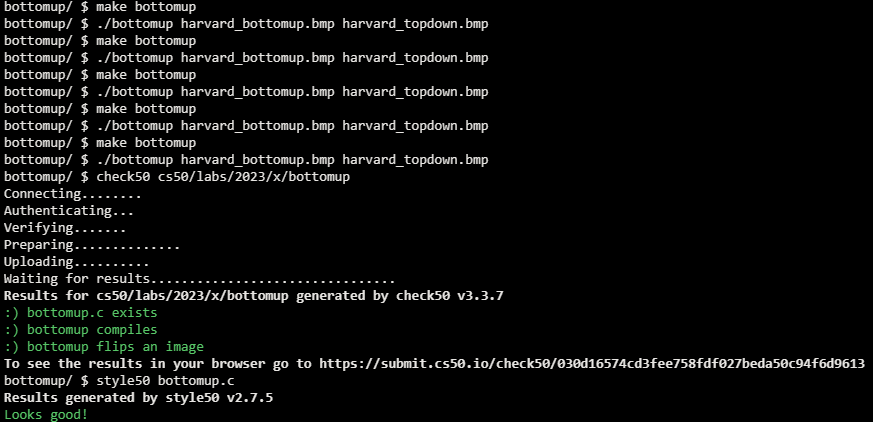

# BottomUp

## Problem Description

### Background

Imagine an image you need to present to your boss for a major presentation somehow got corrupted! Upon investigating, you find that the image is mostly intact. Except, when you view the image, it now appears to be upside down!

Recall that a digital image file is just a sequence of bits, arranged in some fashion. A 24-bit BMP file, then, is essentially just a sequence of bits, (almost) every 24 of which happen to represent some pixel’s color. But a BMP file also contains some “metadata,” information like an image’s height and width. That metadata is stored at the beginning of the file in the form of two data structures generally referred to as “headers,” not to be confused with C’s header files. The first of these headers, called BITMAPFILEHEADER, is 14 bytes long. (Recall that 1 byte equals 8 bits.) The second of these headers, called BITMAPINFOHEADER, is 40 bytes long. Immediately following these headers is the actual bitmap: an array of bytes, triples of which represent a pixel’s color.

Your job is to edit the metadata programmatically so that the bitmap’s top row is first and bottom row last. Best to avoid editing the pixels directly, lest you further corrupt the file!

### Implementation Details

Go ahead and pull up the URLs to which BITMAPFILEHEADER and BITMAPINFOHEADER are attributed, per the comments in bmp.h. Take a close look at the members of the BITMAPINFOHEADER struct. Use that information to write a bit of code in bottomup.c to change the image from bottom-up to top-down. The code in question needn’t be very complicated, particularly if you know what you’re doing!

## My solution

### Description

After hours (and I mean hours) of trying to solve this and almost giving up, I finally paid closer attention to the BITMAPINFOHEADER structure documentation and added the following line before writing the header to the outputfile.

```c
bi.biHeight *= -1;
```

### Initial state of the image


### Final state of the image


## Score



## Usage

1. Compile bottomup.c
2. Run './bottomup'