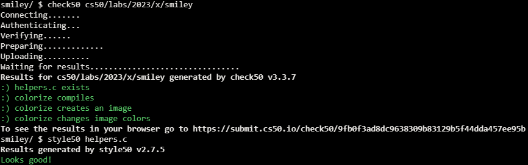

# Lab 4 Smiley

## Problem Description

### Background

You’ve seen in lecture a bit about how images are stored on a computer. In this lab, you’ll practice working with a BMP file, actually the smiley face pictured here, and change all the black pixels to a color of your choosing.

However, the smiley face you’ll be working with is not just made of of 0’s and 1’s, or black and white pixels, but consists of 24 bits per pixel. It uses eight bits to represent red values, eight bits for green and eight bits for blue. Since each color uses eight bits or one byte, we can use a number in the range of 0 to 255 to represent its color value. In hexadecimal, this is represented by 0x00 to 0xff. By mixing together these red, green and blue values, we can create millions of possible colors.

If you look at bmp.h, one of the the helper files in the distribution code, you’ll see how each RGB triple is represented by a struct like:

 ```c
typedef struct
{
    BYTE rgbtBlue;
    BYTE rgbtGreen;
    BYTE rgbtRed;
}
RGBTRIPLE;
```
where BYTE is defined as an 8-bit integer.

You’ll notice several files provided in the distribution code to handle the reading and writing of an image file, as well as handling the image’s metadata or “headers”. You’ll be completing the function colorize in helpers.c, which already has as input parameters, the image’s height, width, and a two-dimensional array of RGBTRIPLE’s which create the image itself.

### Implementation Details

Open up helpers.c and notice that the colorize function is incomplete. Note that the image’s height, width and a two-dimensional array of pixels is set up as the input parameters for this function. You are to implement this function to change all the black pixels in the image to a color of your choosing.

## My solution

### Description

Iterate over the image pixels, if they're black (based on its rgb values), turn them gray.

```c
void colorize(int height, int width, RGBTRIPLE image[height][width])
{
    // Change all black pixels to a color of your choosing
    for (int i = 0; i < height; i++)
    {
        for (int j = 0; j < width; j++)
        {
            // If the pixel is black, turn it gray
            if (image[i][j].rgbtBlue == 0 && image[i][j].rgbtGreen == 0 && image[i][j].rgbtRed == 0)
            {
                image[i][j].rgbtBlue = 50;
                image[i][j].rgbtGreen = 50;
                image[i][j].rgbtRed = 50;
            }
        }
    }
}
```

### Before


### After


## Score



## Usage

1. Run './colorize input output' on your command line.