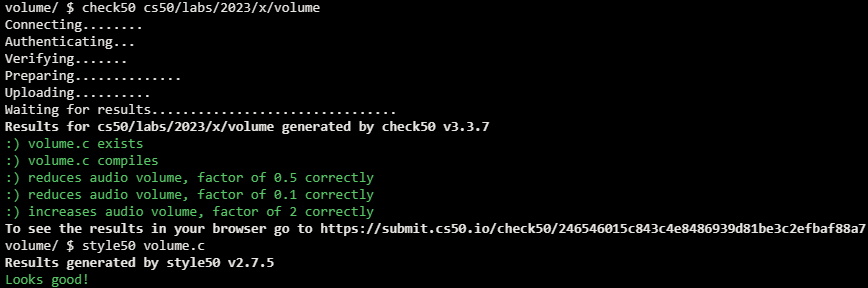

# Lab 4 Volume

## Problem Description

### Background

So far, we’ve seen a number of different types in C, including int, bool, char, double, float, and long. Inside a header file called stdint.h are the declarations of a number of other types that allow us to very precisely define the size (in bits) and sign (signed or unsigned) of an integer. Two types in particular will be useful to us in this lab.

uint8_t is a type that stores an 8-bit unsigned (i.e., not negative) integer. We can treat each byte of a WAV file’s header as a uint8_t value.
int16_t is a type that stores a 16-bit signed (i.e., positive or negative) integer. We can treat each sample of audio in a WAV file as an int16_t value.

### Implementation Details

Complete the implementation of volume.c, such that it changes the volume of a sound file by a given factor.

- The program accepts three command-line arguments: input represents the name of the original audio file, output represents the name of the new audio file that should be generated, and factor is the amount by which the volume of the original audio file should be scaled.
  - For example, if factor is 2.0, then your program should double the volume of the audio file in input and save the newly generated audio file in output.
- Your program should first read the header from the input file and write the header to the output file. Recall that this header is always exactly 44 bytes long.
  - Note that volume.c already defines a variable for you called HEADER_SIZE, equal to the number of bytes in the header.
- Your program should then read the rest of the data from the WAV file, one 16-bit (2-byte) sample at a time. Your program should multiply each sample by the factor and write the new sample to the output file.
  - You may assume that the WAV file will use 16-bit signed values as samples. In practice, WAV files can have varying numbers of bits per sample, but we’ll assume 16-bit samples for this lab.
- Your program, if it uses malloc, must not leak any memory.

## My solution

### Description

Read the header from input and write it to output, then read each int16 sample, multiply it times factor and write it to output.

```c
// Copy header from input file to output file

    uint8_t header[44];

    fread(header, sizeof(uint8_t), 44, input);

    fwrite(header, sizeof(uint8_t), 44, output);

    // Read samples from input file and write updated data to output file

    int16_t sample;

    while (fread(&sample, sizeof(uint16_t), 1, input))
    {
        sample *= factor;
        fwrite(&sample, sizeof(uint16_t), 1, output);
    }
```

## Score



## Usage

1. Run './volume input output factor' on your command line and follow the prompt