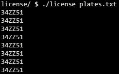
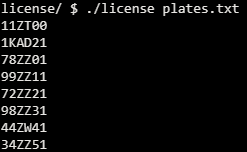
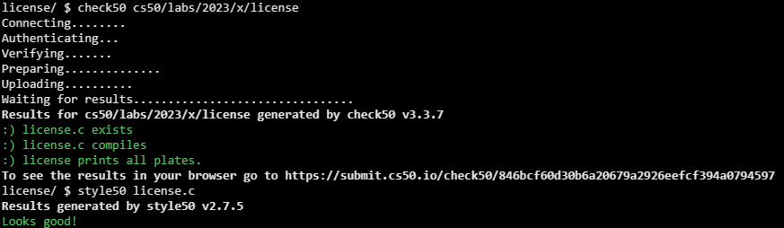

# License

## Problem Description

### Background

Suppose you work for a company that develops AI-enhanced license plate recognition technology. As you develop your technology, you may want to use actual license plate numbers as test data. You have a text file with some plate numbers you want to analyze, so you first try reading from that text file and printing out the license plates, to test your file-reading logic. But when you run your program, only the last number prints 8 times! What went wrong?

### Implementation Details

If you open the plates.txt file, you’ll notice that there are actually 8 different license plate numbers. There are a few errors in the distribution code that are causing this to happen. Let’s start by walking through the code.

We first check for command-line arguments, since argv[1] should be the text file that contains the license plates. We then create a character array of length 7, since the plate numbers are 6 chars long and we need to save space for the NUL terminator. Now we create an array of char *’s (character pointers, otherwise known as strings!) to store the 8 plate numbers. We create a file pointer to our external text file, create a variable to hold the index of each array element, and begin reading the file and saving the plate numbers to the array. Finally, to test that we did this correctly, we print out the values in the array.

However, when we compile and execute this code, something is clearly wrong. You’ll need to make the appropriate corrections!

## My solution

### Description

The issue was that all char pointers in 'plates' were pointing towards 'buffer', even tho the later was changing value, the pointers weren't; so every time 'buffer' changed in value I requested new memory for each pointer to point at and copied the value in buffer to it.

```c
 while (fread(buffer, 1, 7, infile) == 7)
    {
        // Replace '\n' with '\0'
        buffer[6] = '\0';

        // Save plate number in array
        // Have the pointer at 'idx' point towards a new chunk of memory
        plates[idx] = malloc(7 * sizeof(char));

        // Copy buffer into the new chunk of memory
        strcpy(plates[idx], buffer);

        idx++;
    }
```

Then cleared the memory used after it was no longer being needed.
```c
    // Free memory used
    for (int i = 0; i < 8; i++)
    {
        free(plates[i]);
    }

    fclose(infile);
```

### Before



### After



## Score



## Usage

1. Compile license.c
2. Run './license file' on your command line.