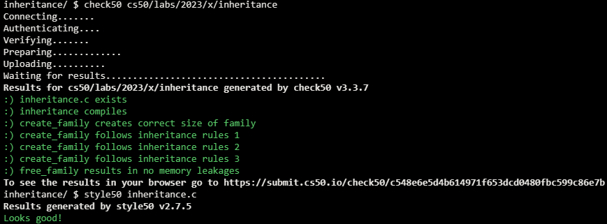

# Lab 5 Inheritance

## Problem Description

### Background

A person’s blood type is determined by two alleles (i.e., different forms of a gene). The three possible alleles are A, B, and O, of which each person has two (possibly the same, possibly different). Each of a child’s parents randomly passes one of their two blood type alleles to their child. The possible blood type combinations, then, are: OO, OA, OB, AO, AA, AB, BO, BA, and BB.

For example, if one parent has blood type AO and the other parent has blood type BB, then the child’s possible blood types would be AB and OB, depending on which allele is received from each parent. Similarly, if one parent has blood type AO and the other OB, then the child’s possible blood types would be AO, OB, AB, and OO.

### Implementation Details

Complete the implementation of inheritance.c, such that it creates a family of a specified generation size and assigns blood type alleles to each family member. The oldest generation will have alleles assigned randomly to them.

- The create_family function takes an integer (generations) as input and should allocate (as via malloc) one person for each member of the family of that number of generations, returning a pointer to the person in the youngest generation.
  - For example, create_family(3) should return a pointer to a person with two parents, where each parent also has two parents.
  - Each person should have alleles assigned to them. The oldest generation should have alleles randomly chosen (as by calling the random_allele function), and younger generations should inherit one allele (chosen at random) from each parent.
  - Each person should have parents assigned to them. The oldest generation should have both parents set to NULL, and younger generations should have parents be an array of two pointers, each pointing to a different parent.


We’ve divided the create_family function into a few TODOs for you to complete.
- First, you should allocate memory for a new person. Recall that you can use malloc to allocate memory, and sizeof(person) to get the number of bytes to allocate.
- Next, we’ve included a condition to check if generations > 1.
  - If generations > 1, then there are more generations that still need to be allocated. We’ve already created two new parents, parent0 and parent1, by recursively calling create_family. Your create_family function should then set the parent pointers of the new person you created. Finally, assign both alleles for the new person by randomly choosing one allele from each parent.
  - Otherwise (if generations == 1), then there will be no parent data for this person. Both parents of your new person should be set to NULL, and each allele should be generated randomly.
- Finally, your function should return a pointer for the person that was allocated.

The free_family function should accept as input a pointer to a person, free memory for that person, and then recursively free memory for all of their ancestors.

- Since this is a recursive function, you should first handle the base case. If the input to the function is NULL, then there’s nothing to free, so your function can return immediately.
- Otherwise, you should recursively free both of the person’s parents before freeing the child.

## My solution

### Description

- create_family: Create a base person and as long as there are generations left to be created, create parents and poitn person to them. 
Randomly assign alleles for people without parents (leaves), and randomly select alleles from within those possible for those who do have parents.

```c
// Create a new individual with `generations`
person *create_family(int generations)
{
    // Allocate memory for new person
    person *p = malloc(sizeof(person));

    // If there are still generations left to create
    if (generations > 1)
    {
        // Create two new parents for current person by recursively calling create_family
        person *parent0 = create_family(generations - 1);
        person *parent1 = create_family(generations - 1);

        // Set parent pointers for current person
        p->parents[0] = parent0;
        p->parents[1] = parent1;

        // Randomly assign current person's alleles based on the alleles of their parents
        p->alleles[0] = p->parents[0]->alleles[rand() % 2];
        p->alleles[1] = p->parents[1]->alleles[rand() % 2];
    }

    // If there are no generations left to create
    else
    {
        // Set parent pointers to NULL
        p->parents[0] = NULL;
        p->parents[1] = NULL;

        // Randomly assign alleles
        p->alleles[0] = random_allele();
        p->alleles[1] = random_allele();
    }

    // TODO: Return newly created person
    return p;
}
```

- free_family(): Recursively free each person from memory.
```c
// Free `p` and all ancestors of `p`.
void free_family(person *p)
{
    // Handle base case
    if (p == NULL)
    {
        return;
    }

    // Free parents recursively
    free_family(p->parents[0]);
    free_family(p->parents[1]);

    // Free child
    free(p);
}
```

## Score



## Usage

1. Run './inheritance' on your command line.