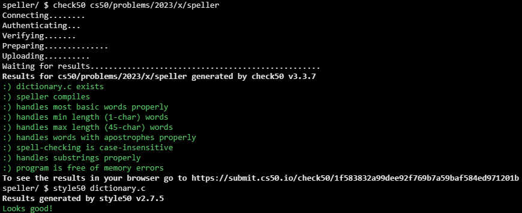

# Speller

## Problem Description

### Background

For this problem, you’ll implement a program that spell-checks a file, a la the below, using a hash table.

### Implementation Details

Alright, the challenge now before you is to implement, in order, load, hash, size, check, and unload as efficiently as possible using a hash table in such a way that TIME IN load, TIME IN check, TIME IN size, and TIME IN unload are all minimized. To be sure, it’s not obvious what it even means to be minimized, inasmuch as these benchmarks will certainly vary as you feed speller different values for dictionary and for text. But therein lies the challenge, if not the fun, of this problem. This problem is your chance to design. Although we invite you to minimize space, your ultimate enemy is time. But before you dive in, some specifications from us.

- You may not alter speller.c or Makefile.
- You may alter dictionary.c (and, in fact, must in order to complete the implementations of load, hash, size, check, and unload), but you may not alter the declarations (i.e., prototypes) of load, hash, size, check, or unload. You may, though, add new functions and (local or global) variables to dictionary.c.
- You may change the value of N in dictionary.c, so that your hash table can have more buckets.
You may alter dictionary.h, but you may not alter the declarations of load, hash, size, check, or unload.
- Your implementation of check must be case-insensitive. In other words, if foo is in dictionary, then check should return true given any capitalization thereof; none of foo, foO, fOo, fOO, fOO, Foo, FoO, FOo, and FOO should be considered misspelled.
- Capitalization aside, your implementation of check should only return true for words actually in dictionary. Beware hard-coding common words (e.g., the), lest we pass your implementation a dictionary without those same words. Moreover, the only possessives allowed are those actually in dictionary. In other words, even if foo is in dictionary, check should return false given foo's if foo's is not also in dictionary.
- You may assume that any dictionary passed to your program will be structured exactly like ours, alphabetically sorted from top to bottom with one word per line, each of which ends with \n. You may also assume that dictionary will contain at least one word, that no word will be longer than LENGTH (a constant defined in dictionary.h) characters, that no word will appear more than once, that each word will contain only lowercase alphabetical characters and possibly apostrophes, and that no word will start with an apostrophe.
- You may assume that check will only be passed words that contain (uppercase or lowercase) alphabetical characters and possibly apostrophes.
- Your spell checker may only take text and, optionally, dictionary as input. Although you might be inclined (particularly if among those more comfortable) to “pre-process” our default dictionary in order to derive an “ideal hash function” for it, you may not save the output of any such pre-processing to disk in order to load it back into memory on subsequent runs of your spell checker in order to gain an advantage.
- Your spell checker must not leak any memory. Be sure to check for leaks with valgrind.
- The hash function you write should ultimately be your own, not one you search for online. There are many ways to implement a hash function beyond using the first character (or characters) of a word. Consider a hash function that uses a sum of ASCII values or the length of a word. A good hash function tends to reduce “collisions” and has a fairly even distribution across hash table “buckets”.

## My solution

### Description

- Load: Iterates over the elements of the dictionary looking for strings, adding each found one into 'table', using the hash() function.

```c
// Loads dictionary into memory, returning true if successful, else false
bool load(const char *dictionary)
{
    // Open dictionary
    FILE *file = fopen(dictionary, "r");
    if (file == NULL)
    {
        printf("Unable to open %s\n", dictionary);
        return false;
    }

    // Scan the file for words
    char word[LENGTH + 1];
    while (fscanf(file, "%s", word) != EOF)
    {
        // Word
        node *n = malloc(sizeof(node));

        if (n == NULL)
        {
            return false;
        }

        // Add word to dictionary
        strcpy(n->word, word);
        key = hash(word);
        n->next = table[key];
        table[key] = n;
        ctr++;
    }
    fclose(file);
    return true;
}
```

- Hash: Simple hash function that returns the average of the combined ASCII values of the letters in 'word'
```c
// Averages ASCII value of each letter in 'word'
unsigned int hash(const char *word)
{
    unsigned long total = 0;
    for (int i = 0; i < strlen(word); i++)
    {
        total += tolower(word[i]);
    }
    return total % N;
}
```

- Check: Iterate over the elements in 'table', comparing them to 'word' and returning the findings.

```c
// Returns true if word is in dictionary, else false
bool check(const char *word)
{
    key = hash(word);
    node *curr = table[key];

    // Iterate over the dictionary, comparing each element to 'word'
    while (curr != 0)
    {
        if (strcasecmp(word, curr->word) == 0)
        {
            return true;
        }
        curr = curr->next;
    }
    return false;
}
```

- Unload: Iterate over the elements in 'table' through 'curr', freeing each as it goes.

```c
// Unloads dictionary from memory, returning true if successful, else false
bool unload(void)
{
    // Iterate over every element on the dictionary
    for (int i = 0; i < N; i++)
    {
        node *curr = table[i];
        while (curr != NULL)
        {
            // Free each node
            node *tmp = curr;
            curr = curr->next;
            free(tmp);
        }
    }
    return true;
}
```

- Size: Returns size

```c
// Returns number of words in dictionary if loaded, else 0 if not yet loaded
unsigned int size(void)
{
    if (ctr > 0)
    {
        return ctr;
    }
    return 0;
}
```

## Score



## Usage

1. Run './speller text' on your command line.