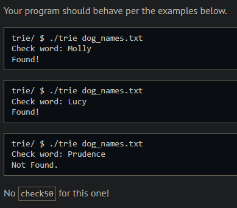

# Trie

## Problem Description

### Background

Imagine you just rescued a dog and you’re deciding on a name. You found a file online with a list of about 150 of the most popular dog names! You are curious as to whether or not the names you are considering are on this list. Since trie’s are great for data lookups, we’ve given you some (almost!) complete code in trie.c. There is one function, check, which is not yet implemented. Your job is to complete this function.

### Implementation Details

Notice that the trie itself is implemented through the creative use of several structs called node. Each node in a trie has an array of (potential) children, with size 26—one potential child for each letter of the alphabet! Adding words to this trie, notice that—for every letter in a word—we create a new node child whose parent is either the root node (for the first letter) or the previous letter (if not the first letter). On the very last letter, we set the is_word attribute of the child node to true. Now, checking if a word is in our trie is as easy as following each letter of that word through our trie. If we get to the final letter and see that is_word is true, well, that name is in our trie!

## My solution

### Description

Iterate over 'word' and the trie at the same time, following the letter path. If at the end there is a word (is_word), return true, else false.

```c
// Complete the check function, return true if found, false if not found
bool check(char *word)
{
    // Pointer to iterate over the trie
    node *cursor = root;

    // Iterate over 'word' and the trie
    for (int i = 0, n = strlen(word); i < n; i++)
    {
        int index = tolower(word[i]) - 'a';

        // Check if 'word'[i]' is in the alphabet
        if (index < 0 || index >= SIZE_OF_ALPHABET)
        {
            return false;
        }

        // The current path on the try doesn't match that of 'word'
        if (cursor->children[index] == NULL)
        {
            return false;
        }
        cursor = cursor->children[index];
    }

    // Both the trie and 'word' share a valid path of letters
    // Return wether 'word' exists on the trie or not
    return cursor->is_word;
}
```
## Output Expected



## Output Obtained


## Usage

1. Run './trie file' on your command line, then follow the prompt.