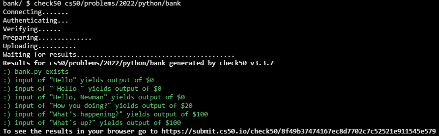

# Bank

## Problem Description

### Background

In a file called bank.py, implement a program that prompts the user for a greeting. If the greeting starts with “hello”, output $0. If the greeting starts with an “h” (but not “hello”), output $20. Otherwise, output $100. Ignore any leading whitespace in the user’s greeting, and treat the user’s greeting case-insensitively.

## My solution

### Description

Ask the user for a greeting, and print the score based on it

```python
greeting = input("Greeting: ").strip()
greeting = greeting[0:5]

if greeting.lower() == "hello":
    score = 0
elif greeting[0].lower() == "h":
    score = 20
else:
    score = 100

print(f'${score}')
```

## Score



## Usage

1. Run 'python bank.py' on your command line and follow the prompt.