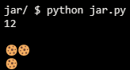

# Jar

## Problem Description

### Implementation Details

Suppose that you’d like to implement a cookie jar in which to store cookies. In a file called jar.py, implement a class called Jar with these methods:

- __init__ should initialize a cookie jar with the given capacity, which represents the maximum number of cookies that can fit in the cookie jar. If capacity is not a non-negative int, though, __init__ should instead raise a ValueError (via raise ValueError).
- __str__ should return a str with 
 🍪, where 
 is the number of cookies in the cookie jar. For instance, if there are 3 cookies in the cookie jar, then str should return "🍪🍪🍪"
- deposit should add n cookies to the cookie jar. If adding that many would exceed the cookie jar’s capacity, though, deposit should instead raise a ValueError.
- withdraw should remove n cookies from the cookie jar. Nom nom nom. If there aren’t that many cookies in the cookie jar, though, withdraw should instead raise a ValueError.
- capacity should return the cookie jar’s capacity.
size should return the number of cookies actually in the cookie jar.

## My solution

```python
class Jar:
    # Initializes jar object
    def __init__(self, capacity=12):
        self.capacity = capacity
        self.size = 0

    # Returns the amount of cookies in the jar, as an emote
    def __str__(self):
        return f"{'🍪' * self.size}"

    # Adds n cookies to the jar
    def deposit(self, n):
        self.size += n

    # Takes n cookies from the jar
    def withdraw(self, n):
        self.size -= n

    # Returns the jar's capacity
    @property
    def capacity(self):
        return self._capacity

    # Capacity setter
    @capacity.setter
    def capacity(self, capacity):
        if type(capacity) is not int or capacity < 0:
            raise ValueError("Capacity should be a positive int")
        self._capacity = capacity

    # Returns the jar's actual amount of cookies
    @property
    def size(self):
        return self._size

    # Size setter
    @size.setter
    def size(self, size):
        if size < 0 or size > self.capacity:
            raise ValueError("Invalid amount")
        self._size = size
```
## Test performed

```python
# Tests
def main():
    jar = Jar()
    print(str(jar.capacity))
    print(str(jar))
    jar.deposit(2)
    print(str(jar))
    jar.withdraw(1)
    print(str(jar))
```

## Output Obtained



## Usage

1. Run 'python jar.py' on your command line.