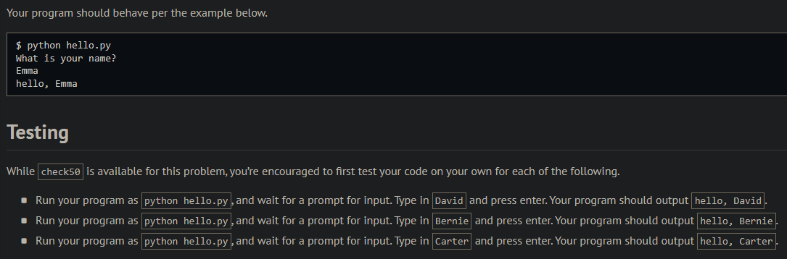
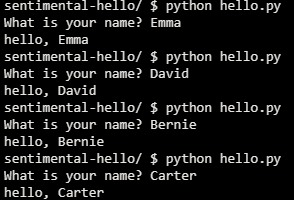
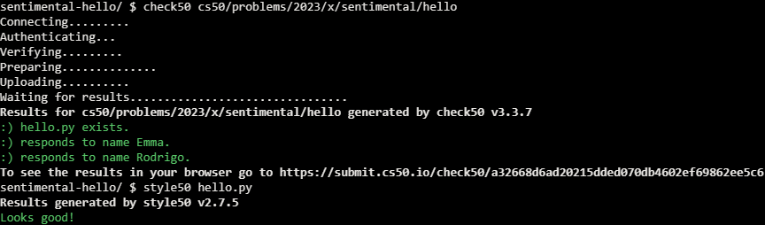

# Hello

## Problem Description

Implement a program that prints out a simple greeting to the user, per the below.

### Implementation Details

Write, in a file called hello.py, a program that prompts a user for their name, and then prints hello, so-and-so, where so-and-so is their provided name, exactly as you did in Problem Set 1, except that your program this time should be written in Python.

## My solution

```python
def main():
    name = input("What is your name? ")
    print(f"hello, {name}")
```

## Output Expected



## Output Obtained



## Score



## Usage

1. Run 'python hello.py' on your command line and follow the prompt.