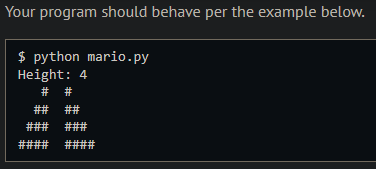
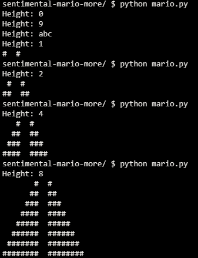
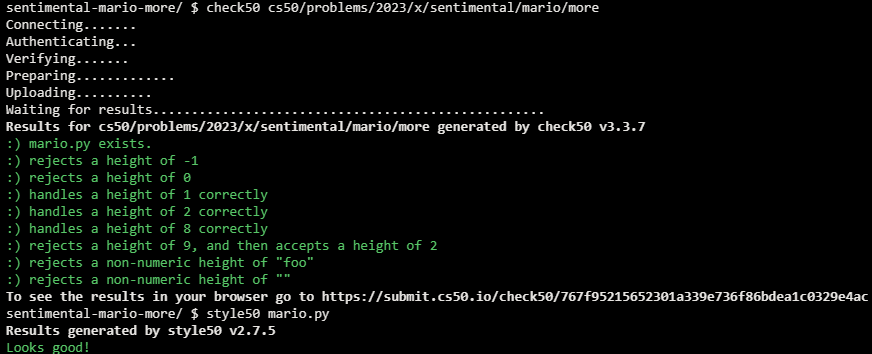

# Mario-More

## Problem Description

Implement a program that prints out a double half-pyramid of a specified height, per the below.

### Implementation Details

- Write, in a file called mario.py, a program that recreates these half-pyramids using hashes (#) for blocks, exactly as you did in Problem Set 1, except that your program this time should be written in Python.
- To make things more interesting, first prompt the user with get_int for the half-pyramid’s height, a positive integer between 1 and 8, inclusive. (The height of the half-pyramids pictured above happens to be 4, the width of each half-pyramid 4, with a gap of size 2 separating them).
- If the user fails to provide a positive integer no greater than 8, you should re-prompt for the same again.
- Then, generate (with the help of print and one or more loops) the desired half-pyramids.
- Take care to align the bottom-left corner of your pyramid with the left-hand edge of your terminal window, and ensure that there are two spaces between the two pyramids, and that there are no additional spaces after the last set of hashes on each row.

## My solution

```python
def main():
    # Get valid input
    while (True):
        height = input("Height: ")
        if height.isdigit():
            height = int(height)
            if 0 < height < 9:
                break

    # Print the pyramid
    for i in range(1, height + 1):
        print(f"{' ' * (height - i)}{'#' * i}  {'#' * i}")
```

## Output Expected



## Output Obtained



## Score



## Usage

1. Run 'python mario.py' on your command line and follow the prompt.