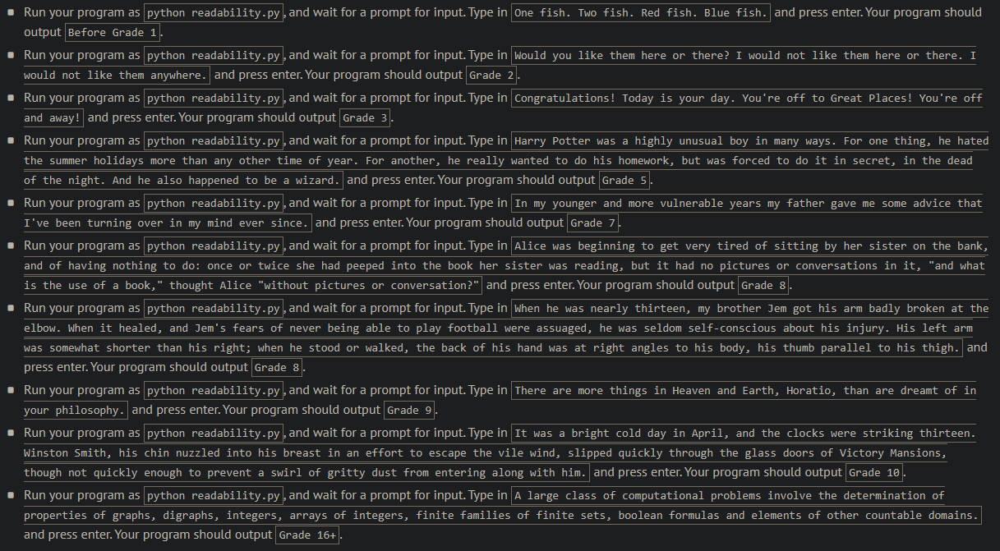
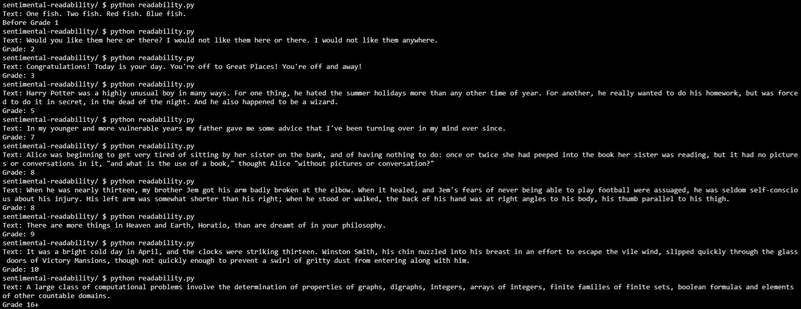
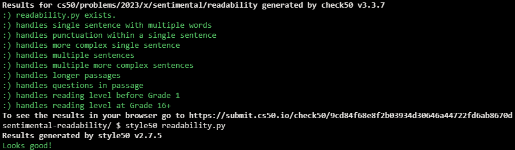

# Readability

## Problem Description

### Background

A number of “readability tests” have been developed over the years that define formulas for computing the reading level of a text. One such readability test is the Coleman-Liau index. The Coleman-Liau index of a text is designed to output that (U.S.) grade level that is needed to understand some text. The formula is

index = 0.0588 * L - 0.296 * S - 15.8

where L is the average number of letters per 100 words in the text, and S is the average number of sentences per 100 words in the text.

Let’s write a program called readability that takes a text and determines its reading level. For example, if user types in a line of text from Dr. Seuss, the program should behave as follows:

### Implementation Details

Design and implement a program, readability, that computes the Coleman-Liau index of text.

- Implement your program in a file called readability.c in a directory called readability.
- Your program must prompt the user for a string of text using get_string.
- Your program should count the number of letters, words, and sentences in the text. You may assume that a letter is any lowercase character from a to z or any uppercase character from A to Z, any sequence of characters separated by spaces should count as a word, and that any occurrence of a period, exclamation point, or question mark indicates the end of a sentence.
- Your program should print as output "Grade X" where X is the grade level computed by the Coleman-Liau formula, rounded to the nearest integer.
- If the resulting index number is 16 or higher (equivalent to or greater than a senior undergraduate reading level), your program should output "Grade 16+" instead of giving the exact index number. If the index number is less than 1, your program should output "Before Grade 1".

## My solution

```python
# Coleman-Liau formula
def grade(text):

    letters = words = sentences = 0

    # Gets proper values from text
    for char in text:
        if char in ['.', '?', '!']:
            sentences += 1
        elif char == ' ':
            words += 1
        elif char.isalpha():
            letters += 1
    words += 1  # Accounts for last word (which isn't delimited by a blank space)

    L = (letters * 100) / words
    S = (sentences * 100) / words
    grade = round(0.0588 * L - 0.296 * S - 15.8)

    # Output
    if grade >= 16:
        return 'Grade 16+'
    elif grade < 1:
        return 'Before Grade 1'
    return f'Grade: {grade}'
```

## Output Expected



## Output Obtained



## Score



## Usage

1. Run 'python readability.py' on your command line and follow the prompt.