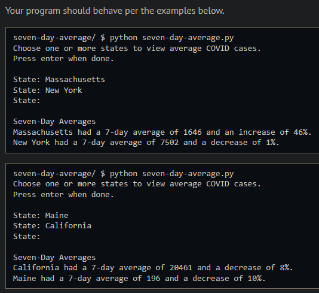
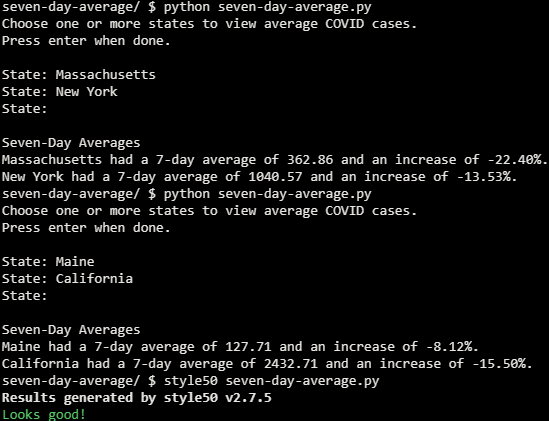

# Seven Day Average 

## Problem Description

### Background

A popular way to track COVID cases is using a 7-day average. Some states only record cases once a week, so using a 7-day average is much more accurate than daily numbers. In this program, you will be using a New York Times repository of live, cumulative COVID data to calculate new daily cases, create a 7-day average, and compare this week’s average to the previous week.

### Implementation Details

The distribution code for this problem uses the python requests library to access the New York Times data stored in an accessible GitHub repository. This is stored as a CSV file. The program then uses DictReader to read the CSV file. It then creates a states list to use selected states for calculations.

You will be completing two functions, calculate and comparative_averages.

#### Calculate
In calculate, you’ll be creating a dictionary, new_cases, which will keep track of 14 days of new COVID cases for each state. Keys in this dict will be the names of states, and the values for each of those keys will be the most recent 14 days of new cases. Since the data from the New York Times is cumulative, each day’s new cases must be calculated by subtracting the previous day’s cases. To do this, you may want to create a second dictionary, previous_cases, that keeps track of each day’s new cases as it’s calculated.

Your calculate function should ultimately return the new_cases dictionary.

#### Comparative_averages
Since your new_cases dictionary is passed to this function, you can calculate this week’s 7-day average by summing up the last 7 elements in the list for a selected state, then dividing this by 7. You can create a 7-day average for the previous week by doing the same with the first 7 elements in that same list.

You can then calculate the percent increase or decrease, by taking the difference of the two 7-day averages and dividing by last week’s average.

## My solution

- Calculate: Iterate over 'reader', adding the appropriate information to 'new_cases' and 'previous_cases'.

```python
    for entry in reader_copy:
        date = entry["date"]
        state = entry["state"]
        cases = int(entry["cases"])

        # Calculate how many days have passed since the last entry for 'state'
        skipped = days_between(date, previous_cases[state]['date']) - 1

        # Handles initial scenario where 'start_date' and 'date' are the same
        if skipped < 0:
            skipped = 0

        new_cases[state].extend([0 for i in range(skipped)])  # Appends a 0 to the state's cases list for each skipped day
        new_cases[state].append(cases - previous_cases[state]['cases'])  # Apppends the latest entry

        # Updates 'previous_cases'
        previous_cases[state]['date'] = date
        previous_cases[state]['cases'] = cases

        # If there's more than 14 entries, remove the oldest
        if len(new_cases[state]) > 14:
            new_cases[state].pop(0)
```
```python
# Calculate and print out seven day average for given state
def comparative_averages(new_cases, states):
    for state in states:
        latest_avg = get_avg(new_cases[state][7:15])  # Average of the last 7 days
        previous_avg = get_avg(new_cases[state][0:7])  # Average of the 7 days before ^

        try:
            comp_avg = (latest_avg - previous_avg) / previous_avg
        except ZeroDivisionError:
            comp_avg = 0.0

        print(f'{state} had a 7-day average of {latest_avg:.2f} and an increase of {(comp_avg * 100):.2f}%.')
```
```python
# Returns the days between d1 and d2
def days_between(d1, d2):
    d1 = datetime.strptime(d1, "%Y-%m-%d")
    d2 = datetime.strptime(d2, "%Y-%m-%d")
    return (d2 - d1).days
```
```python
# Returns average of elements in lst
def get_avg(lst):
    try:
        return sum(lst) / len(lst)
    except ZeroDivisionError:
        return 0.0
```

## Output Example



## Output Obtained



The output isn't the same as in the example since the input data has been updated, but the differences check out since covid cases (and their reports) have gone down.

## Usage

1. Run 'python seven-day-average.py' on your command line and follow the prompt.